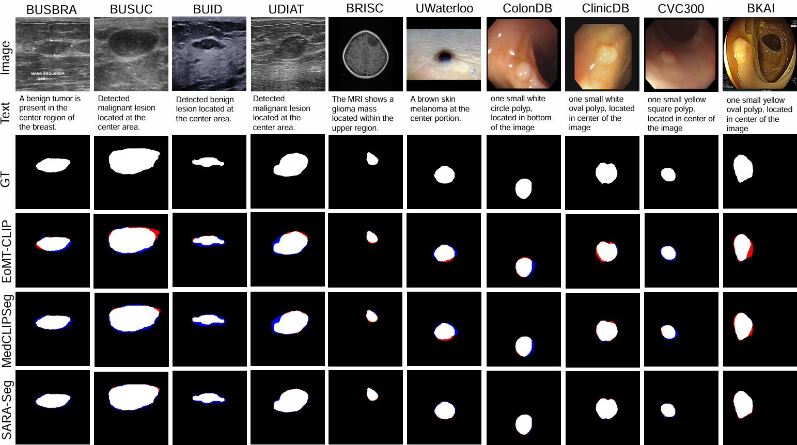

# SARA-Seg: Semantic Anchoring and Reliability-Aware Adaptation for Medical Image Segmentation

[[`Project Page`](https://sara-seg.netlify.app/)]

<p align="center">
  
</p>

This repository provides the official PyTorch implementation of **SARA-Seg**, a unified medical image segmentation framework designed to improve semantic alignment, reliable multimodal adaptation, boundary recovery, and cross-domain generalization.

SARA-Seg contains three main components:

- **Semantic Anchoring**, which constructs image-specific semantic anchors from internally distilled visual representations and uses them to calibrate external textual semantics;
- **Reliability-Aware Adaptation**, which selectively controls semantic querying and feature updating through a probabilistic adaptation gate;
- **Structure-Consistent Refinement**, which jointly models region and boundary information and feeds structural cues back into the segmentation representation.

The method is evaluated on **16 public medical image segmentation datasets** covering **ultrasound, MRI, dermoscopy, endoscopy, and X-ray imaging**.

---

## Environment

The following environment is recommended:

```shell
Ubuntu: 20.04
Python: 3.10
CUDA: 11.8
PyTorch: 2.0.1
GPU: NVIDIA RTX A6000
```

Other recent PyTorch and CUDA versions may also work.

---

## Installation

### 1. Clone the repository

```shell
git clone https://github.com/TianFangzheng/SARA-Seg.git
cd SARA-Seg
```

### 2. Create a conda environment

```shell
conda create -n sara-seg python=3.10 -y
conda activate sara-seg
```

### 3. Install PyTorch

For CUDA 11.8:

```shell
pip install torch==2.0.1 torchvision==0.15.2 \
    --index-url https://download.pytorch.org/whl/cu118
```

### 4. Install the remaining dependencies

```shell
pip install -r requirements.txt
```

The main dependencies include:

```text
torch
torchvision
numpy
scipy
pandas
Pillow
opencv-python
scikit-image
scikit-learn
PyYAML
tqdm
einops
openpyxl
huggingface_hub
```

---

## Pretrained Vision-Language Backbone

SARA-Seg uses **UniMedCLIP ViT-B/16** as the pretrained vision-language backbone.

Install the Hugging Face command-line tool:

```shell
pip install -U huggingface_hub
```

Download the pretrained UniMedCLIP weights:

```shell
mkdir -p pretrained/UniMedCLIP

huggingface-cli download \
    UzairK/unimed-clip-vit-b16 \
    unimed-clip-vit-b16.pt \
    --local-dir pretrained/UniMedCLIP
```

After downloading, the checkpoint should be located at:

```text
pretrained/UniMedCLIP/unimed-clip-vit-b16.pt
```

The pretrained model path can be specified in the experiment configuration:

```yaml
MODEL:
  BACKBONE: UniMedCLIP-ViT-B16
  PRETRAINED: pretrained/UniMedCLIP/unimed-clip-vit-b16.pt
```

---

## Dataset Download

SARA-Seg is evaluated on 16 public datasets.

### In-Distribution Datasets

| Modality | Dataset |
|---|---|
| Ultrasound | BUSI |
| MRI | BTMRI |
| Dermoscopy | ISIC |
| Endoscopy | Kvasir-SEG |
| X-ray | QaTa-COV19 |
| Endoscopic ultrasound | EUS |

### Out-of-Distribution Datasets

| Modality | Dataset |
|---|---|
| Breast ultrasound | BUSBRA |
| Breast ultrasound | BUSUC |
| Breast ultrasound | BUID |
| Breast ultrasound | UDIAT |
| Brain MRI | BRISC |
| Dermoscopy | UWaterlooSkinCancer |
| Endoscopy | CVC-ColonDB |
| Endoscopy | CVC-ClinicDB |
| Endoscopy | CVC-300 |
| Endoscopy | BKAI |

The standardized image-mask pairs, textual prompts, and dataset splits used in the experiments can be downloaded from the MedCLIPSeg dataset repository:

```shell
mkdir -p data/MedCLIPSeg

huggingface-cli download \
    TahaKoleilat/MedCLIPSeg \
    --repo-type dataset \
    --local-dir data/MedCLIPSeg
```

Alternatively, the datasets may be downloaded separately from their original sources. Please follow the license and usage requirements of each dataset.

Raw medical images are not redistributed directly by this repository.

---

## Data Preparation

Each dataset should contain images, binary segmentation masks, and image-specific textual prompts.

A recommended organization is:

```text
data/
└── MedCLIPSeg/
    ├── BUSI/
    │   ├── images/
    │   ├── masks/
    │   ├── train.xlsx
    │   ├── val.xlsx
    │   └── test.xlsx
    ├── BTMRI/
    ├── ISIC/
    ├── Kvasir-SEG/
    ├── QaTa-COV19/
    ├── EUS/
    ├── BUSBRA/
    ├── BUSUC/
    ├── BUID/
    ├── UDIAT/
    ├── BRISC/
    ├── UWaterlooSkinCancer/
    ├── CVC-ColonDB/
    ├── CVC-ClinicDB/
    ├── CVC-300/
    └── BKAI/
```

The image and mask files should use the same filename stem:

```text
images/case_001.png
masks/case_001.png
```

Each spreadsheet should contain the image filename and the corresponding textual prompt:

| image | text |
|---|---|
| case_001.png | The image shows a lesion with an irregular boundary. |
| case_002.png | The image contains a small low-contrast target. |

Before training, verify the dataset paths:

```shell
python tools/check_dataset.py \
    --data-root data/MedCLIPSeg \
    --dataset BUSI
```

The script checks:

- whether every image has a corresponding mask;
- whether all textual prompts are available;
- whether training, validation, and testing splits are complete;
- whether corrupted or unsupported files are present.

---

## Configuration

All experiment settings are controlled through YAML configuration files.

The important settings include:

```yaml
DATA:
  ROOT: data/MedCLIPSeg
  DATASET: BUSI
  IMAGE_SIZE: 224
  NUM_WORKERS: 8

MODEL:
  BACKBONE: UniMedCLIP-ViT-B16
  PRETRAINED: pretrained/UniMedCLIP/unimed-clip-vit-b16.pt
  EMBED_DIM: 256
  NUM_ANCHORS: 8
  EMA_MOMENTUM: 0.99

TRAIN:
  EPOCHS: 100
  BATCH_SIZE: 8
  OPTIMIZER: AdamW
  LEARNING_RATE: 0.0001
  WEIGHT_DECAY: 0.0001
  SEED: 42

OUTPUT:
  DIR: outputs/BUSI
```

Only the last two visual Transformer blocks are fine-tuned by default, while the text encoder remains frozen.

---

## Training

### Standard Supervised Training

Train SARA-Seg on BUSI:

```shell
python train.py \
    --config configs/supervised/BUSI.yaml
```

Train on another dataset by replacing the configuration file:

```shell
python train.py \
    --config configs/supervised/ISIC.yaml
```

The training process records:

- training and validation losses;
- Dice score;
- normalized surface Dice;
- boundary evaluation metrics;
- best validation checkpoint;
- latest checkpoint;
- complete experiment configuration;
- training logs.

---

## Resume Training

Resume training from the latest checkpoint:

```shell
python train.py \
    --config configs/supervised/BUSI.yaml \
    --resume outputs/BUSI/checkpoints/latest.pth
```

Resume training from a specified epoch:

```shell
python train.py \
    --config configs/supervised/BUSI.yaml \
    --resume outputs/BUSI/checkpoints/epoch_050.pth
```

---

## Evaluation

Evaluate the best checkpoint on the test split:

```shell
python test.py \
    --config configs/supervised/BUSI.yaml \
    --checkpoint outputs/BUSI/checkpoints/best.pth
```

Save segmentation probability maps and binary masks:

```shell
python test.py \
    --config configs/supervised/BUSI.yaml \
    --checkpoint outputs/BUSI/checkpoints/best.pth \
    --save-predictions \
    --output-dir results/BUSI
```

The evaluation script reports:

- Dice similarity coefficient;
- IoU;
- normalized surface Dice;
- sensitivity;
- specificity;
- precision;
- Hausdorff distance;
- boundary Dice.

---

## Data-Efficiency Evaluation

The data-efficiency experiments use 10%, 25%, 50%, and 100% of the available training data.

Train with 10% of the training set:

```shell
python train.py \
    --config configs/data_efficiency/BUSI_10.yaml
```

Train with 25%, 50%, or 100% of the data:

```shell
python train.py --config configs/data_efficiency/BUSI_25.yaml
python train.py --config configs/data_efficiency/BUSI_50.yaml
python train.py --config configs/data_efficiency/BUSI_100.yaml
```

Run all data-efficiency experiments:

```shell
bash scripts/run_data_efficiency.sh
```

---

## Cross-Dataset Domain Generalization

For domain generalization, the model is trained on a source dataset and evaluated directly on unseen target datasets without target-domain fine-tuning.

### Breast Ultrasound

Train on BUSI:

```shell
python train.py \
    --config configs/domain_generalization/BUSI.yaml
```

Evaluate the BUSI-trained model on BUSBRA:

```shell
python test.py \
    --config configs/domain_generalization/BUSBRA.yaml \
    --checkpoint outputs/domain_generalization/BUSI/best.pth
```

Evaluate on all unseen breast ultrasound datasets:

```shell
bash scripts/eval_breast_ultrasound_ood.sh
```

The target datasets include:

```text
BUSBRA
BUSUC
BUID
UDIAT
```

### Brain MRI

Train on BTMRI and evaluate on BRISC:

```shell
python train.py \
    --config configs/domain_generalization/BTMRI.yaml

python test.py \
    --config configs/domain_generalization/BRISC.yaml \
    --checkpoint outputs/domain_generalization/BTMRI/best.pth
```

### Dermoscopy

Train on ISIC and evaluate on UWaterlooSkinCancer:

```shell
python train.py \
    --config configs/domain_generalization/ISIC.yaml

python test.py \
    --config configs/domain_generalization/UWaterlooSkinCancer.yaml \
    --checkpoint outputs/domain_generalization/ISIC/best.pth
```

### Endoscopy

Train on Kvasir-SEG and evaluate on unseen polyp datasets:

```shell
python train.py \
    --config configs/domain_generalization/Kvasir-SEG.yaml

bash scripts/eval_endoscopy_ood.sh
```

The target datasets include:

```text
CVC-ColonDB
CVC-ClinicDB
CVC-300
BKAI
```

---

## Boundary Evaluation

To evaluate the quality of the predicted boundaries:

```shell
python evaluate_boundary.py \
    --prediction-dir results/BUSI/predictions \
    --ground-truth-dir data/MedCLIPSeg/BUSI/masks
```

The boundary evaluation reports normalized surface Dice, boundary Dice, Hausdorff distance, and average surface distance.

---

## Ablation Experiments

The contributions of the main SARA-Seg components can be evaluated independently.

### Disable Semantic Anchoring

```shell
python train.py \
    --config configs/ablation/without_semantic_anchoring.yaml
```

### Disable Reliability-Aware Adaptation

```shell
python train.py \
    --config configs/ablation/without_reliability_adaptation.yaml
```

### Disable Structure-Consistent Refinement

```shell
python train.py \
    --config configs/ablation/without_structure_refinement.yaml
```

### Run All Ablation Experiments

```shell
bash scripts/run_ablation.sh
```

---

## Pretrained Checkpoints

Pretrained checkpoints for the supervised, data-efficiency, and domain-generalization experiments will be provided through the project page and the release page of this repository.

After downloading, place them under:

```text
checkpoints/
├── supervised/
├── data_efficiency/
└── domain_generalization/
```

Evaluate a downloaded checkpoint:

```shell
python test.py \
    --config configs/supervised/BUSI.yaml \
    --checkpoint checkpoints/supervised/BUSI_best.pth
```

---

## Reproducing the Main Experiments

The complete experimental evaluation can be reproduced using:

```shell
bash scripts/run_supervised.sh
bash scripts/run_data_efficiency.sh
bash scripts/run_domain_generalization.sh
bash scripts/run_boundary_evaluation.sh
bash scripts/run_ablation.sh
```

To summarize the results:

```shell
python tools/collect_results.py \
    --input-dir outputs \
    --output-file results_summary.xlsx
```

For reproducibility, all experiments use:

```text
Random seed: 42
Input resolution: 224 × 224
Training epochs: 100
Batch size: 8
Optimizer: AdamW
Learning rate: 1e-4
Number of semantic anchors: 8
EMA momentum: 0.99
```

---

## Qualitative Results

Additional qualitative comparison results are available on the project page:

[https://sara-seg.netlify.app/](https://sara-seg.netlify.app/)

<p align="center">
  
</p>

---

## Citation

If you find this work useful, please consider citing:

```bibtex
@article{gu2026saraseg,
  title   = {SARA-Seg: Semantic Anchoring and Reliability-Aware Adaptation for Medical Image Segmentation},
  author  = {Gu, Jia and Tian, Fangzheng and Liu, Yanli},
  journal = {Biomedical Signal Processing and Control},
  year    = {2026}
}
```

The citation information will be updated after publication.

---

## Acknowledgement

We thank the authors of **UniMedCLIP** and **MedCLIPSeg** for releasing their pretrained models, datasets, textual prompts, and implementation resources. We also thank the creators of all public medical image datasets used in this study.
