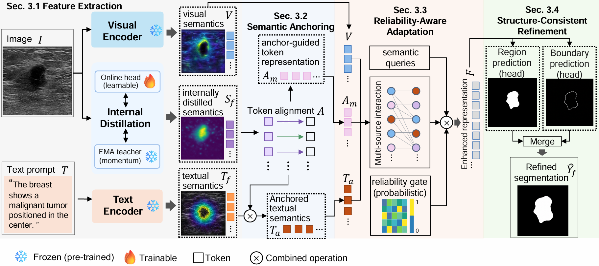

# SARA-Seg: Semantic Anchoring and Reliability-Aware Adaptation for Medical Image Segmentation

[[`Project Page`](https://sara-seg.netlify.app/)]

<p align="center">
  
</p>

This is the official PyTorch implementation of **SARA-Seg**, a medical image segmentation framework that integrates semantic anchoring, reliability-aware adaptation, and structure-consistent refinement.

---

## Environment

The following environment is recommended:

```shell
Ubuntu: 20.04 or 22.04
Python: 3.10
CUDA: 11.8 or 12.1
PyTorch: 2.0 or later
GPU: NVIDIA RTX A6000 48 GB
```

## Installation

### 1. Clone this repository

```shell
git clone https://github.com/TianFangzheng/SARA-Seg.git
cd SARA-Seg
```

### 2. Create a conda environment

```shell
conda create -n sara-seg python=3.10 -y
conda activate sara-seg
```

### 3. Install PyTorch

For CUDA 12.1:

```shell
pip install torch torchvision --index-url https://download.pytorch.org/whl/cu121
```

For other CUDA versions, please install the corresponding PyTorch build from the official PyTorch website.

### 4. Install the remaining dependencies

```shell
pip install -r requirements.txt
```

## Pretrained Vision-Language Backbone

SARA-Seg uses the UniMedCLIP ViT-B/16 model as the visual and textual backbone.

Install the Hugging Face command-line tool:

```shell
pip install huggingface_hub
```

Download the pretrained model:

```shell
mkdir -p pretrained
huggingface-cli download \
    UzairK/unimed-clip-vit-b16 \
    unimed-clip-vit-b16.pt \
    --local-dir pretrained
```

The directory should contain:

```text
SARA-Seg/
└── pretrained/
    └── unimed-clip-vit-b16.pt
```

## Dataset Preparation

We follow the dataset splits and image-specific textual prompts used by MedCLIPSeg.

The standardized dataset resources can be downloaded from:

- [MedCLIPSeg dataset repository](https://huggingface.co/datasets/TahaKoleilat/MedCLIPSeg)
- [MedCLIPSeg dataset preparation instructions](https://github.com/HealthX-Lab/MedCLIPSeg/blob/main/assets/DATASETS.md)

The experiments use the following datasets.

### In-distribution datasets

- BUSI
- BTMRI
- ISIC
- Kvasir-SEG
- QaTa-COV19
- EUS

### Unseen target datasets for domain generalization

- BUSBRA
- BUSUC
- BUID
- UDIAT
- BRISC
- UWaterlooSkinCancer
- CVC-ColonDB
- CVC-ClinicDB
- CVC-300
- BKAI

Due to the licenses of the original datasets, the raw medical images are not redistributed in this repository.

### Expected directory structure

Each dataset should be organized as follows:

```text
DATASET_ROOT/
├── img/
│   ├── image_001.png
│   ├── image_002.png
│   └── ...
├── label/
│   ├── image_001.png
│   ├── image_002.png
│   └── ...
├── Train_text.xlsx
├── Val_text.xlsx
└── Test_text.xlsx
```

The image and mask should have the same filename stem. A mask filename ending with `_mask` is also supported.

Each spreadsheet should contain:

- an image identifier column named `image`, `image_id`, `img`, `filename`, `file_name`, or `name`;
- a textual prompt column named `text`, `prompt`, `caption`, `report`, or `description`.

An example is shown below:

| image | text |
|---|---|
| image_001.png | The image shows a breast lesion with an irregular boundary. |
| image_002.png | The image contains a small hypoechoic mass. |

## Configuration

The training settings are defined in YAML files under `configs/`.

Before training, update the dataset root and output directory:

```yaml
DATASET:
  ROOT: ./data/BUSI

TRAIN:
  OUTPUT_DIR: ./outputs/sara_seg_busi
```

The default example configuration is:

```text
configs/sara_seg_busi.yaml
```

For another dataset, copy this file and modify `DATASET.ROOT` and `TRAIN.OUTPUT_DIR`.

## Training

Train SARA-Seg on BUSI:

```shell
python train_sara_seg.py \
    --config configs/sara_seg_busi.yaml
```

The training outputs are saved under the directory specified by `TRAIN.OUTPUT_DIR`:

```text
outputs/sara_seg_busi/
├── best.pt
├── last.pt
├── tokenizer.json
├── resolved_config.json
└── history.json
```

- `best.pt`: checkpoint with the best validation Dice score;
- `last.pt`: checkpoint from the final epoch;
- `tokenizer.json`: tokenizer vocabulary generated from the textual prompts;
- `resolved_config.json`: complete configuration used for the experiment;
- `history.json`: training and validation history.

## Evaluation

Evaluate a trained model on the test split:

```shell
python test_sara_seg.py \
    --checkpoint outputs/sara_seg_busi/best.pt \
    --split test \
    --output-dir results/BUSI
```

The script reports the Dice score and saves the predicted masks.

### Cross-Dataset Domain Generalization

A source-domain checkpoint can be evaluated directly on an unseen target dataset by overriding the dataset root:

```shell
python test_sara_seg.py \
    --checkpoint outputs/sara_seg_busi/best.pt \
    --data-root ./data/BUSBRA \
    --split test \
    --output-dir results/BUSBRA
```

For breast ultrasound domain generalization, a model trained on BUSI can be evaluated on BUSBRA, BUSUC, BUID, and UDIAT without target-domain fine-tuning.

## Repository Structure

```text
SARA-Seg/
├── assets/
│   └── overview.png
├── configs/
│   └── sara_seg_busi.yaml
├── pretrained/
│   └── unimed-clip-vit-b16.pt
├── sara_seg/
│   ├── __init__.py
│   ├── datasets.py
│   ├── losses.py
│   ├── model.py
│   ├── tokenizer.py
│   └── utils.py
├── train_sara_seg.py
├── test_sara_seg.py
├── requirements.txt
└── README.md
```

## Main Modules

SARA-Seg consists of the following three main components:

1. **Semantic Anchoring**
   - online and EMA teacher branches;
   - soft semantic-anchor assignment;
   - image-specific semantic-anchor construction;
   - anchor-guided textual calibration;
   - token-aligned anchor representation.

2. **Reliability-Aware Adaptation**
   - multi-source semantic interaction;
   - probabilistic gate parameterization;
   - gate-controlled semantic querying;
   - adaptive fusion of queried semantics and visual features.

3. **Structure-Consistent Refinement**
   - parallel region and boundary prediction;
   - differentiable region-boundary consistency;
   - boundary-aware feature feedback;
   - final refined segmentation prediction.

## Reproducing the Experiments

To reproduce the experiments reported in the paper:

1. prepare the 16 datasets using the same image-text pairs and data splits;
2. update the dataset paths in the configuration files;
3. train the source-domain model using `train_sara_seg.py`;
4. evaluate the checkpoint using `test_sara_seg.py`;
5. for domain generalization, evaluate the same source checkpoint on each unseen target dataset without fine-tuning.

All experiments use a fixed random seed of 42 unless otherwise specified.

## Citation

The citation information will be added after publication.

## Acknowledgement

This repository builds upon the publicly available resources of [UniMedCLIP](https://huggingface.co/UzairK/unimed-clip-vit-b16) and follows the dataset organization and image-specific prompt protocol of [MedCLIPSeg](https://github.com/HealthX-Lab/MedCLIPSeg).
